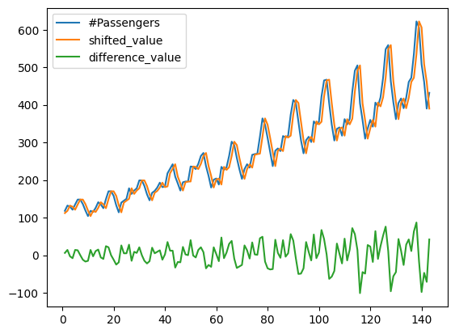
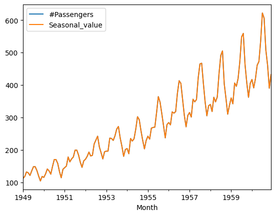
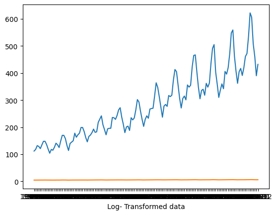

# Ex.No: 1B                     CONVERSION OF NON STATIONARY TO STATIONARY DATA
## Date: 
## AIM:
To perform regular differncing,seasonal adjustment and log transformatio on international airline passenger data
## ALGORITHM:
1. Import the required packages like pandas and numpy
2. Read the data using the pandas
3. Perform the data preprocessing if needed and apply regular differncing,seasonal adjustment,log transformation.
4. Plot the data according to need, before and after regular differncing,seasonal adjustment,log transformation.
5. Display the overall results.
## PROGRAM:
### Name : YUVARAJ.S
### Register Number : 212222240119
### REGULAR DIFFERENCING
```py
import pandas as pd
import matplotlib.pyplot as plt
import numpy as np
data=pd.read_csv("AirPassengers.csv")
data.head(5)
passengers = pd.DataFrame(data)
passengers['shifted_value']=passengers['#Passengers'].shift(1)
passengers['difference_value']=passengers['#Passengers']-passengers['shifted_value']
passengers.dropna(inplace=True)
print(passengers)
passengers.plot(kind='line')
```
### SEASONAL ADJUSTMENT
```py
import pandas as pd
import numpy as np
import matplotlib.pyplot as plt
from statsmodels.tsa.seasonal import seasonal_decompose
data=pd.read_csv("AirPassengers.csv",parse_dates=['Month'],index_col='Month')
passengers=pd.DataFrame(data)
result=seasonal_decompose(passengers['#Passengers'],model='additive',period=1)
seasonal=result.seasonal
passengers['Seasonal_value']=passengers['#Passengers']-seasonal
passengers.dropna(inplace=True)
print(passengers)
passengers.plot(kind='line')
```
### LOG TRANSFORMATIONS
```py
import numpy as np
import pandas as pd
data= pd.read_csv('AirPassengers.csv')
data.head()
data.dropna(inplace=True)
x=data['Month']
y=data['#Passengers']
data_log=np.log(data['#Passengers'])
X=data['Month']
Y=data_log
import matplotlib.pyplot as plt
plt.plot(x,y)
plt.xlabel('Original Data')
plt.plot(X,Y)
plt.xlabel('Log- Transformed data')
```

## OUTPUT:
### REGULAR DIFFERENCING:

### SEASONAL ADJUSTMENT:

### LOG TRANSFORMATION:

## RESULT:
Thus we have created the python code for the conversion of non stationary to stationary data on international airline passenger
data.
